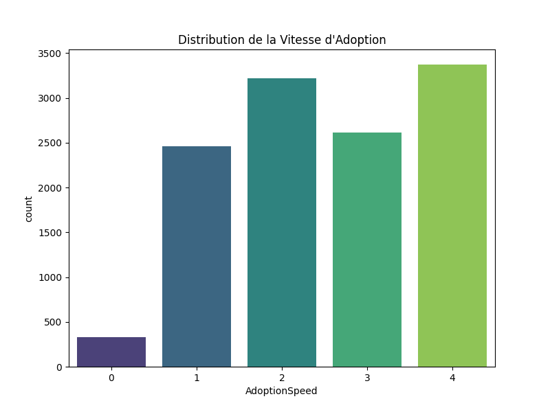
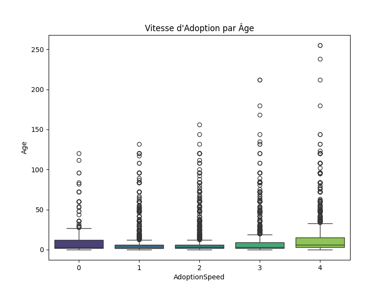
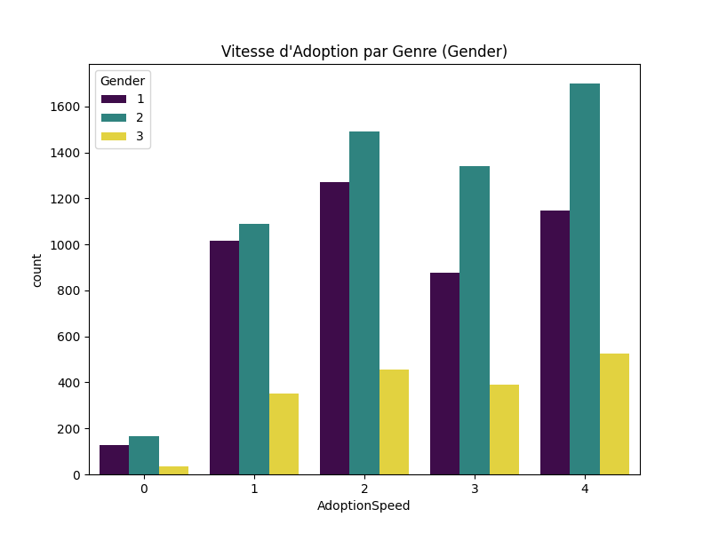
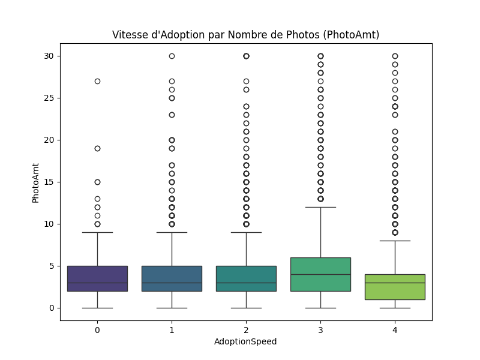
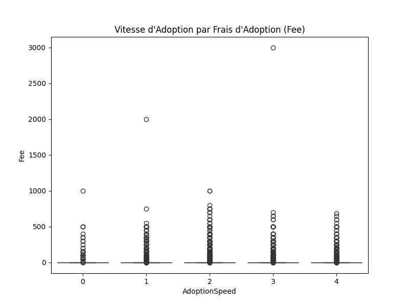
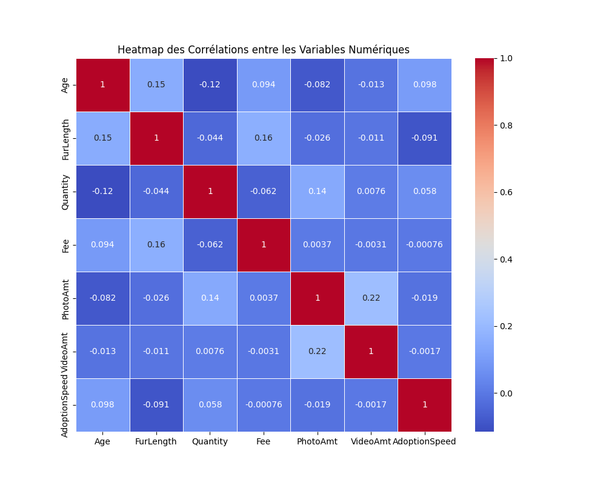

# Challenge machine learning pour la prédiction d'adoption d'animaux
## Sommaire
- [**Préparation des Données et Extraction des Caractéristiques**](#préparation-des-données-et-extraction-des-caractéristiques)
    - [Importation des bibliothèques nécessaires](#importation-des-bibliothèques-nécessaires)
    - [Définir le chemin du fichier de données](#définir-le-chemin-du-fichier-de-données)
    - [Chargement des données d'entraînement](#chargement-des-données-dentraînement)
        - [Vérification du chargement](#vérification-du-chargement)
    - [Traitement des descriptions (utilisation de TF-IDF sur les données d'entraînement)](#traitement-des-descriptions-utilisation-de-tf-idf-sur-les-données-dentraînement)
    - [Ajout des nouvelles features basées sur TF-IDF](#ajout-des-nouvelles-features-basées-sur-tf-idf)
    - [Sélection des features numériques et catégoriques](#sélection-des-features-numériques-et-catégoriques)
- [**Graphiques**](#graphiques)
    - [Distribution de la vitesse d'adoption](#graphique-1--distribution-de-la-vitesse-dadoption)
    - [Vitesse d'adoption par âge](#graphique-2--vitesse-dadoption-par-âge)
    - [Vitesse d'adoption par genre](#graphique-3--vitesse-dadoption-par-genre)
    - [Vitesse d'adoption par longueur de fourrure (FurLength)](#graphique-4--vitesse-dadoption-par-longueur-de-fourrure-furlength)
    - [Vitesse d'adoption en fonction du nombre de photos](#graphique-5--vitesse-dadoption-en-fonction-du-nombre-de-photos)
    - [Vitesse d'adoption en fonction des frais d'adoption](#graphique-6--vitesse-dadoption-en-fonction-des-frais-dadoption)
    - [Corrélation entre les variables numériques](#graphique-7--corrélation-entre-les-variables-numériques)
    - [Vitesse d'adoption par taille de maturité (MaturitySize)](#graphique-8--vitesse-dadoption-par-taille-de-maturité-maturitysize)
    - [Vitesse d'adoption par couleur principale (Color1)](#graphique-9--vitesse-dadoption-par-couleur-principale-color1)
    - [Vitesse d'adoption par état de santé (Health)](#graphique-10--vitesse-dadoption-par-état-de-santé-health)
    - [Vitesse d'adoption par race primaire (Breed1)](#graphique-11--vitesse-dadoption-par-race-primaire-breed1)
    - [Vitesse d'adoption en fonction du nombre d'animaux (Quantity)](#graphique-12--vitesse-dadoption-en-fonction-du-nombre-danimaux-quantity)
- [**Entraînement, Validation et Prédiction du Modèle RandomForest avec Extraction de Features Textuelles**](#entraînement-validation-et-prédiction-du-modèle-randomforest-avec-extraction-de-features-textuelles)
    - [Séparation des données en ensemble d'entraînement et de validation](#séparation-des-données-en-ensemble-dentraînement-et-de-validation)
    - [Création du modèle avec validation croisée et recherche d'hyperparamètres pour RandomForestClassifier](#création-du-modèle-avec-validation-croisée-et-recherche-dhyperparamètres-pour-randomforestclassifier)
    - [Meilleurs paramètres et performance sur l'ensemble de validation](#meilleurs-paramètres-et-performance-sur-lensemble-de-validation)
    - [Chargement des données de test](#chargement-des-données-de-test)
    - [Application du même TF-IDF sur les données de test](#application-du-même-tf-idf-sur-les-données-de-test)
    - [Ajout des nouvelles features basées sur TF-IDF aux données de test](#ajout-des-nouvelles-features-basées-sur-tf-idf-aux-données-de-test)
    - [Prédictions sur l'ensemble de test](#prédictions-sur-lensemble-de-test)
    - [Sauvegarde des résultats](#sauvegarde-des-résultats)
    - [Sauvegarde dans un fichier CSV](#sauvegarde-dans-un-fichier-csv)
- [**Conclusion**](#conclusion)
    - [résultat de la prédiction du meilleur submission](#résultat-de-la-prédiction-du-meilleur-submission)
    - [Arctype des Facteurs Affectant la Vitesse d'Adoption](#arctype)
        - [Vitesse d'Adoption 0 (Très rapide)](#vitesse-dadoption-0-très-rapide-)
        - [Vitesse d'Adoption 1 (Rapide)](#vitesse-dadoption-1-rapide)
        - [Vitesse d'Adoption 2 (Moyennement rapide)](#vitesse-dadoption-2-moyennement-rapide)
        - [Vitesse d'Adoption 3 (Lente)](#vitesse-dadoption-3-lente)
        - [Vitesse d'Adoption 4 (Très lente)](#vitesse-dadoption-4-très-lente)
- [**Lien du fichier du modèle**](../modèle_text_RandomForestClassifier_graph.py)
# Préparation des Données et Extraction des Caractéristiques
## Importation des bibliothèques nécessaires
```python
import os
import pandas as pd
import numpy as np
import seaborn as sns
import matplotlib.pyplot as plt
from sklearn.ensemble import RandomForestClassifier
from sklearn.model_selection import train_test_split, GridSearchCV, StratifiedKFold
from sklearn.metrics import accuracy_score
from sklearn.feature_extraction.text import TfidfVectorizer
from sklearn.preprocessing import StandardScaler
```
Ce bloc importe les bibliothèques requises pour manipuler les données, créer des visualisations, entraîner le modèle de machine learning, et effectuer des prétraitements. Ces bibliothèques incluent `pandas`, `numpy`, `seaborn`, `matplotlib` pour la manipulation de données et la visualisation, ainsi que `sklearn` pour la modélisation.

## Définir le chemin du fichier de données
```python
DATA_PATH_TRAIN = './asset/data/train_data.csv'
DATA_PATH_TEST = './asset/data/test_data.csv'
```
Ici, les chemins vers les fichiers de données d'entraînement et de test sont définis pour être utilisés tout au long du script. Les fichiers contiennent les informations sur les animaux et leurs caractéristiques.

## Chargement des données d'entraînement
```python
print("Chargement des données d'entraînement...")
train_df = pd.read_csv(DATA_PATH_TRAIN)
```
Cette étape charge les données d'entraînement à partir du fichier CSV spécifié. Elle permet de vérifier le nombre de lignes dans le dataset et d'afficher les premières lignes pour s'assurer du bon chargement des données.

### Vérification du chargement
```python
print(f"Nombre de lignes dans le dataset d'entraînement : {len(train_df)}")
print(train_df.head())
```

## Traitement des descriptions (utilisation de TF-IDF sur les données d'entraînement)
```python
print("Traitement des descriptions avec TF-IDF...")
tfidf = TfidfVectorizer(max_features=500)  # Limitation à 500 features pour éviter trop de dimensions
description_tfidf = tfidf.fit_transform(train_df['Description'].astype(str))
```
Le **TF-IDF** (Term Frequency-Inverse Document Frequency) est appliqué à la colonne de description des animaux pour convertir les textes en vecteurs numériques, permettant ainsi d'utiliser les descriptions dans le modèle de machine learning.

## Ajout des nouvelles features basées sur TF-IDF
```python
tfidf_df = pd.DataFrame(description_tfidf.toarray(), columns=[f"tfidf_{i}" for i in range(description_tfidf.shape[1])])
train_df = pd.concat([train_df, tfidf_df], axis=1)
```
Les vecteurs générés par le TF-IDF sont ajoutés aux autres caractéristiques (features) du dataset. Cela permet d'inclure les informations textuelles dans l'ensemble final de données d'entraînement.

## Sélection des features numériques et catégoriques
```python
numerical_features = ["Age", "FurLength", "Quantity", "Fee", "PhotoAmt", "VideoAmt"]
categorical_features = ["Vaccinated", "Dewormed", "Sterilized", "Health", "Breed1", "Breed2", "Gender", "Color1", "Color2", "Color3", "MaturitySize"]
target = "AdoptionSpeed"
```
Cette section sélectionne les colonnes pertinentes du dataset, divisant les features en deux catégories : **numériques** (comme l'âge, les frais d'adoption) et **catégoriques** (comme le genre, l'état de santé).

# Graphiques

Ces graphiques visuels permettent d'analyser la relation entre la vitesse d'adoption et différentes caractéristiques (comme l'âge, le genre, la longueur de la fourrure, etc.). Ils aident à mieux comprendre les facteurs qui influencent la vitesse d'adoption.
## Graphique 1 : Distribution de la vitesse d'adoption
```python
plt.figure(figsize=(8, 6))
sns.countplot(data=train_df, x="AdoptionSpeed", palette="viridis")
plt.title("Distribution de la Vitesse d'Adoption")
plt.show()
```


## Graphique 2 : Vitesse d'adoption par âge
```python
plt.figure(figsize=(8, 6))
sns.boxplot(data=train_df, x="AdoptionSpeed", y="Age", palette="viridis")
plt.title("Vitesse d'Adoption par Âge")
plt.show()
```


## Graphique 3 : Vitesse d'adoption par genre
```python
plt.figure(figsize=(8, 6))
sns.countplot(data=train_df, x="AdoptionSpeed", hue="Gender", palette="viridis")
plt.title("Vitesse d'Adoption par Genre (Gender)")
plt.show()
```


## Graphique 4 : Vitesse d'adoption par longueur de fourrure (FurLength)
```python
plt.figure(figsize=(8, 6))
sns.countplot(data=train_df, x="AdoptionSpeed", hue="FurLength", palette="viridis")
plt.title("Vitesse d'Adoption par Longueur de Fourrure (FurLength)")
plt.show()
```
.")

## Graphique 5 : Vitesse d'adoption en fonction du nombre de photos
```python
plt.figure(figsize=(8, 6))
sns.boxplot(data=train_df, x="AdoptionSpeed", y="PhotoAmt", palette="viridis")
plt.title("Vitesse d'Adoption par Nombre de Photos (PhotoAmt)")
plt.show()
```


## Graphique 6 : Vitesse d'adoption en fonction des frais d'adoption
```python
plt.figure(figsize=(8, 6))
sns.boxplot(data=train_df, x="AdoptionSpeed", y="Fee", palette="viridis")
plt.title("Vitesse d'Adoption par Frais d'Adoption (Fee)")
plt.show()
```


## Graphique 7 : Corrélation entre les variables numériques
```python
plt.figure(figsize=(10, 8))
correlation_matrix = train_df[numerical_features + [target]].corr()
sns.heatmap(correlation_matrix, annot=True, cmap="coolwarm", linewidths=0.5)
plt.title("Heatmap des Corrélations entre les Variables Numériques")
plt.show()
```


## Graphique 8 : Vitesse d'adoption par taille de maturité (MaturitySize)
```python
plt.figure(figsize=(8, 6))
sns.countplot(data=train_df, x="AdoptionSpeed", hue="MaturitySize", palette="viridis")
plt.title("Vitesse d'Adoption par Taille de Maturité (MaturitySize)")
plt.show()
```
.")

## Graphique 9 : Vitesse d'adoption par couleur principale (Color1)
```python
plt.figure(figsize=(8, 6))
sns.countplot(data=train_df, x="AdoptionSpeed", hue="Color1", palette="viridis")
plt.title("Vitesse d'Adoption par Couleur Principale (Color1)")
plt.show()
```
.")

## Graphique 10 : Vitesse d'adoption par état de santé (Health)
```python
plt.figure(figsize=(8, 6))
sns.countplot(data=train_df, x="AdoptionSpeed", hue="Health", palette="viridis")
plt.title("Vitesse d'Adoption par État de Santé (Health)")
plt.show()
```
.")

## Graphique 11 : Vitesse d'adoption par race primaire (Breed1)
```python
plt.figure(figsize=(8, 6))
sns.countplot(data=train_df, x="AdoptionSpeed", hue="Breed1", palette="viridis")
plt.title("Vitesse d'Adoption par Race Primaire (Breed1)")
plt.show()
```
.")

## Graphique 12 : Vitesse d'adoption en fonction du nombre d'animaux (Quantity)
```python
plt.figure(figsize=(8, 6))
sns.boxplot(data=train_df, x="AdoptionSpeed", y="Quantity", palette="viridis")
plt.title("Vitesse d'Adoption par Quantité d'Animaux (Quantity)")
plt.show()
```
.")

# Entraînement, Validation et Prédiction du Modèle RandomForest avec Extraction de Features Textuelles

## Séparation des données en ensemble d'entraînement et de validation
```python
print("Séparation des données en ensemble d'entraînement et de validation...")
X = train_df[numerical_features + categorical_features + list(tfidf_df.columns)]
y = train_df[target]

X_train, X_val, y_train, y_val = train_test_split(X, y, test_size=0.3, random_state=42)
```
Les données sont divisées en deux ensembles : un pour l'entraînement du modèle et un pour la validation. Cela permet d'évaluer la performance du modèle sur un ensemble de données non vu.

## Création du modèle avec validation croisée et recherche d'hyperparamètres pour RandomForestClassifier
```python
print("Recherche des meilleurs hyperparamètres avec GridSearchCV pour RandomForestClassifier...")
model = RandomForestClassifier(random_state=42)
param_grid = {
    'n_estimators': [100, 200, 500],
    'max_depth': [None, 10, 20, 30],
    'min_samples_split': [2, 5, 10]
}

grid_search = GridSearchCV(estimator=model, param_grid=param_grid, cv=StratifiedKFold(5), 
                           scoring='accuracy', n_jobs=-1, verbose=1)  # Utilisation de n_jobs=-1 pour utiliser tous les cœurs du CPU
grid_search.fit(X_train, y_train)
```
Ici, un modèle **RandomForestClassifier** est entraîné. Une recherche d'hyperparamètres via **GridSearchCV** permet de tester différentes combinaisons de paramètres pour optimiser le modèle. La validation croisée est utilisée pour évaluer les performances du modèle de manière robuste.

## Meilleurs paramètres et performance sur l'ensemble de validation
```python
print(f"Meilleurs hyperparamètres : {grid_search.best_params_}")
best_model = grid_search.best_estimator_
y_val_pred = best_model.predict(X_val)

print(f"Score de validation : {accuracy_score(y_val, y_val_pred)}")
```
Les meilleurs hyperparamètres sont extraits à partir de la recherche avec **GridSearchCV**, et le modèle est évalué sur l'ensemble de validation pour obtenir un score de performance.

## Chargement des données de test
```python
print("Chargement des données de test...")
test_df = pd.read_csv(DATA_PATH_TEST)
```
Cette étape charge les données de test, qui seront utilisées pour évaluer les prédictions du modèle sur un ensemble de données que le modèle n'a jamais vu auparavant.

## Application du même TF-IDF sur les données de test
```python
print("Application de TF-IDF sur les données de test...")
description_tfidf_test = tfidf.transform(test_df['Description'].astype(str))  # Utilisation de transform (et non fit_transform)
tfidf_test_df = pd.DataFrame(description_tfidf_test.toarray(), columns=[f"tfidf_{i}" for i in range(description_tfidf_test.shape[1])])
```
Les descriptions textuelles dans le fichier de test sont traitées de la même manière que dans les données d'entraînement, en appliquant le modèle TF-IDF déjà formé.

## Ajout des nouvelles features basées sur TF-IDF aux données de test
```python
test_df = pd.concat([test_df, tfidf_test_df], axis=1)
```
Les features textuelles générées par TF-IDF sont ajoutées aux autres caractéristiques des données de test pour assurer que le modèle puisse les utiliser pour la prédiction.

## Prédictions sur l'ensemble de test
```python
X_test = test_df[numerical_features + categorical_features + list(tfidf_test_df.columns)]
print("Prédictions sur les données de test...")
y_test_preds = best_model.predict(X_test)
```
Le modèle entraîné est utilisé pour effectuer des prédictions sur les données de test, en essayant de prédire la vitesse d'adoption de chaque animal dans l'ensemble de test.

## Sauvegarde des résultats
```python
test_preds = test_df.copy()
test_preds[target] = y_test_preds
submission_df = test_preds[["PetID", target]]  # PetID étant l'identifiant dans le fichier test
```

### Sauvegarde dans un fichier CSV
```python
submission_path = './asset/data/submission_text_RandomForestClassifier_graph.csv'
submission_df.to_csv(submission_path, index=False)
print(f"Prédictions sauvegardées dans {submission_path}")

print("Fin de l'exécution.")
```
Les résultats des prédictions (la vitesse d'adoption prédite pour chaque animal) sont sauvegardés dans un fichier CSV, permettant une analyse ultérieure des performances ou une soumission dans le cadre d'un concours.

# Conclusion
## résultat de la prédiction du meilleur submission
Le meilleur résultat pour moi, se trouve être en utilisant `RandomForestClassifier` avec les hyperparamètre `{'max_depth': None, 'min_samples_split': 5, 'n_estimators': 500}` pour un score de `0.45566`
## Arctype des Facteurs Affectant la Vitesse d'Adoption
### **Vitesse d'Adoption 0 (Très rapide) :**

- **Facteurs positifs** :
    - **Santé** : Animaux en très bonne santé (Health 1).
    - **Taille de maturité** : Petits animaux (MaturitySize 1).
    - **Fourrure** : Fourrure courte (FurLength 1).
- **Facteurs modérés** :
    - **Âge** : Très jeunes animaux, surtout les bébés ou jeunes (inférieurs à 10 mois).
    - **Genre** : Animaux de genre 2 (Femelle) légèrement plus adoptés que les autres.
### **Vitesse d'Adoption 1 (Rapide)**

- **Facteurs positifs** :
    - **Santé** : Très bonne santé (Health 1).
    - **Taille de maturité** : Animaux de petite taille (MaturitySize 1), certains de taille moyenne.
    - **Fourrure** : Fourrure courte ou modérément longue.
- **Facteurs modérés** :
    - Âge : Les jeunes animaux (entre 1 et 3 ans) sont adoptés rapidement.
    - Genre : Le genre 2 continue d'avoir un léger avantage.

### **Vitesse d'Adoption 2 (Moyennement rapide)**

- **Facteurs neutres** :
    - **Santé** : Les animaux en bonne santé (Health 1) sont adoptés à un rythme modéré.
    - **Taille de maturité** : Les animaux de taille moyenne (MaturitySize 2) sont adoptés dans cette catégorie.
    - **Fourrure** : Les animaux à fourrure modérée (FurLength 2) tombent dans cette catégorie.
- **Facteurs influents** :
    - **Frais d'adoption** : Des frais d'adoption bas ou moyens (moins de 100) peuvent influencer cette vitesse.
    - **Nombre de photos** : Un nombre de photos modéré (4 à 5) peut favoriser une adoption plus rapide dans cette catégorie.
### **Vitesse d'Adoption 3 (Lente)**

- Facteurs négatifs :
    - **Santé** : Les animaux en santé modérée (Health 2).
    - **Taille de maturité** : Animaux de taille plus grande (MaturitySize 3).
    - **Âge** : Les animaux plus âgés (au-delà de 5 ans) commencent à être adoptés plus lentement.
    - **Fourrure** : Fourrure longue (FurLength 3) associée à une adoption plus lente.
### **Vitesse d'Adoption 4 (Très lente)**

- **Facteurs très négatifs** :
    - **Santé** : Problèmes de santé importants (Health 3) ralentissent fortement l'adoption.
    - **Taille de maturité** : Animaux de grande taille (MaturitySize 3 et 4) sont adoptés très lentement.
    - **Âge** : Animaux plus âgés, souvent au-delà de 7 à 8 ans.
    - **Fourrure** : Les animaux à fourrure très longue et difficile à entretenir sont adoptés plus lentement.
- **Autres facteurs** :
    - **Quantité** : Si plusieurs animaux sont adoptés ensemble, cela ralentit fortement le processus (surtout si plus de 3 animaux).